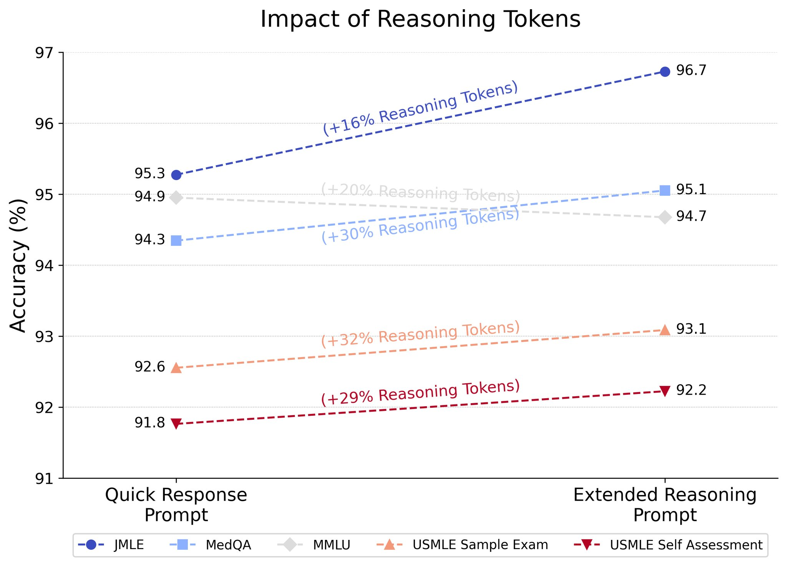

---
aliases:
- /medical-evals
categories:
- LLMs
- deep learning
- medical AI
date: '2025-02-21'
description: 'Time to move to new benchmarks!'
hide: true
layout: post
permalink: /llm-medical-evals
search_exclude: false
title: 'LLMs in medicine: evaluations, advances, and the future'
author: Tanishq Mathew Abraham, Ph.D.
toc: true
format:
  html:
    comments:
      utterances:
        repo: tmabraham/blog
        issue-term: "title"

---

## Introduction

Large Language Models (LLMs) have shown significant potential for medical applications yet many challenges remain. Let's talk about the state of LLMs in medicine, how these models are evaluated, how the latest models are improving, and the future of the field.

Significant progress in the field has been made by Google and Microsoft/OpenAI[^1]. Here are some of the models these companies have developed either for medical use-cases or been tested specifically on medical tasks:

Google: Med-PaLM → Med-PaLM 2 → Med-PaLM M → AMIE and Med-Gemini
OpenAI: GPT-3 → GPT-4 → GPT-o1-preview[^2]

[^1]: Even though Microsoft and OpenAI are separate, I keep them together because so far OpenAI hasn't published any separate medical AI research while Microsoft publishes their evaluations of OpenAI models on medical tasks, although that may change in the future with OpenAI’s new health AI team. 

[^2]: o1 and o3-mini have not been evaluated on medical tasks yet, as far as I know.

Note that Google’s strategy so far has been to fine-tune their general purpose models for medical use-cases, while Microsoft takes OpenAI general-purpose models and directly applies them to medical tasks.

The open-source community has also produced models that have been evaluated for medical tasks, including Llama, Mistral, Qwen, and the DeepSeek-series models. In addition, certain models have been specifically fine-tuned for medical applications, such as Meditron.

## How LLM medical capabilities are evaluated

Until fairly recently, the prevalent way of evaluating model performance for medical tasks is to report performance on multiple choice medical question answering (MCQA) benchmarks. This practice was popularized by Google’s Med-PaLM paper, which introduced the MultiMedQA benchmark. This benchmark is itself a suite of a few other benchmarks:

* PubMedQA - 1,000 expert-labeled Q&A pairs where a question and corresponding PubMed abstract as context is given, and a yes/maybe/no answer must be produced. Unlike the rest of the tasks in this suite, PubMedQA is a closed-domain Q&A task.

* MedQA - US Medical License Exam (USMLE) questions with 4 or 5 possible answers. Typically, only the 4-option questions are used.

* MedMCQA - 4-option multiple choice questions from Indian medical entrance examinations, >191k total questions.

* MMLU - 4-option multiple choice exam questions from a variety of domains. The following six domains are utilized here:
  + Anatomy
  + Clinical Knowledge
  + College Medicine
  + Medical Genetics
  + Professional Medicine
  + College Biology

Here is a representative example of a QA pair from each dataset:
| Dataset | Question | Options | Answer |
| --- | --- | --- | --- |
| PubMedQA | Do preoperative statins reduce atrial fibrillation after coronary artery bypass grafting? | yes or no | yes |
| MedQA | A 57-year-old man presents to his primary care physician with a 2-month history of right upper and lower extremity weakness. He noticed the weakness when he started falling far more frequently while running errands. Since then, he has had increasing difficulty with walking and lifting objects. His past medical history is significant only for well-controlled hypertension, but he says that some members of his family have had musculoskeletal problems. His right upper extremity shows forearm atrophy and depressed reflexes while his right lower extremity is hypertonic with a positive Babinski sign. Which of the following is most likely associated with the cause of this patient's symptoms? | A: HLA-B8 haplotype \n B: HLA-DR2 haplotype \n C: Mutation in SOD1 \n D: Mutation in SMN1 \n E: Viral infection | C |
| MedMCQA | Which drug is a selective COX 2 inhibitor? | A: Celecoxib \n B: Acetaminophen \n C: Ketorolac \n D: Aspirin | A |
| MMLU | Which of the following conditions does not show multifactorial inheritance? | A: Pyloric stenosis \n B: Schizophrenia \n C: Spina bifida (neural tube defects) \n D: Marfan syndrome | D |

When papers report “LLM X beats humans on medical license exams” they typically refer to models surpassing baseline human performance on benchmarks such as MedQA and MedMCQA (or also a separate USMLE benchmark).

Current state-of-the-art LLMs have already achieved very high accuracy on these tasks. For example, Med-Gemini achieved 91.1% on MedQA. Many of these benchmarks are being saturated and losing their utility. In fact, some researchers noticed that many of the questions that LLMs get wrong actually have incorrect ground truth labels!

Based on this, you might assume LLMs have solved medicine. You would be incorrect.

All of these benchmarks consist of multiple choice questions. When you consult a doctor, do you imagine a list of potential diagnoses floating above your head, waiting for the doctor to simply choose the right one? Unfortunately not! Multiple choice question answering benchmarks can assess if an LLM contains medical knowledge and basic medical capabilities, but it does not accurately represent the actual practice of medicine!

## Going beyond multiple-choice question answering

Over the past year or so, especially with MultiMedQA being saturated by recent well-performing LLMs, researchers have become acutely aware of the challenges of current medical MCQA benchmarks. For this reason, researchers have started evaluating LLMs in new ways that they hope better align with actual medical use-cases.

For example, at the end of 2023, Google published a paper on how well a medically finetuned variant of PaLM-2 (distinct from Med-PaLM 2) performed on differential diagnoses using a new benchmark. New England Journal of Medicine (NEJM) Clinicopathological Conference Case Reports are lightly edited transcriptions of the clinicopathological conferences of the Mass General Hospital. In a clinicopathological conference, a patient case (medical history, test results, etc.) is described and an expert physician is asked to provide a differential diagnosis and a final diagnosis. These cases are published regularly in the NEJM as “diagnostic puzzles”. Many papers are now using these cases to evaluate LLMs, although different cases are used between different studies.

Google’s LLM achieved 59.1% accuracy in including the correct diagnosis somewhere in its top 10 differential diagnoses—better than unassisted doctors at 33.6%. When doctors used the LLM as an assistant, they achieved 51.7% accuracy versus 44.4% with just search tools. 

This certainly seems very promising, but we shouldn’t read too much into these results. Let us consider how there remain weaknesses to this benchmark. All the necessary information to make the diagnosis is provided upfront and there is no back-and-forth between patient and physician. Real medical practice requires gathering information dynamically from patients, and dealing with uncertainty, which these carefully structured benchmarks cannot evaluate.

Researchers recognized this gap and several research groups have now developed novel frameworks for evaluating LLMs for clinical settings, each taking different approaches to attempt to simulate more realistic medical practices:

CRAFT-MD (Oct 2023), developed by researchers at Harvard Medical School and Stanford, introduced a framework using three AI agents: a patient agent, doctor agent (the LLM being evaluated), and a grader agent. Their evaluation used three main data sources: 1,800 case vignettes from MedQA dataset, 100 questions from an online medical question bank focused on dermatology, and 100 newly generated private dermatology cases created by dermatologists. The researchers specifically focused on dermatology to evaluate how well LLMs could conduct nuanced conversations about symptoms, progression, and medical history. Their evaluation revealed that diagnostic accuracy drops significantly when LLMs need to gather information through conversation rather than being presented with all information upfront. For example, GPT-4's accuracy dropped from 82% to 62.7% when moving from static case descriptions to conversations. They also examined how biases affected performance, finding that while GPT-4 was relatively robust, other models like Mixtral-8x7B showed significant performance degradation when biases were introduced.

AMIE (Jan 2024), developed by Google DeepMind, took a different approach by conducting a randomized, double-blind crossover study comparing their LLM system against primary care physicians using standardized patient actors. The study used 149 scenario packs sourced from multiple regions: 75 from India, 60 from Canada, and 14 from the UK. These scenarios covered conditions across multiple specialties including cardiovascular, respiratory, gastroenterology, neurology, and obstetrics/gynecology, though notably excluded pediatric and psychiatric cases. The study revealed that AMIE outperformed physicians on 28 of 32 evaluation axes according to specialist physicians and 24 of 26 axes according to patient actors. However, the authors note important limitations, particularly that the text-chat interface may have disadvantaged human physicians who are more accustomed to in-person or video consultations.

AgentClinic (Oct 2024), from researchers at Stanford and Johns Hopkins, introduced a broader framework supporting multiple medical specialties, multiple languages, and multimodal inputs like medical imaging. Their evaluation environment drew from several datasets: the MedQA USMLE dataset for general medical scenarios, MIMIC-IV database for realistic patient cases, NEJM case challenges (120 cases) for multimodal evaluation, and MedMCQA dataset for specialist cases across 9 medical specialties. They also created multilingual versions in 7 languages (Chinese, Hindi, Korean, Spanish, French, Persian, and English). Their evaluation showed Claude-3.5 achieved the highest performance with 62.1% accuracy on their benchmark, while also demonstrating that different models varied significantly in their ability to utilize tools like experiential learning and adaptive retrieval.

MIMIC-CDM (Sept 2024), from researchers at Technical University of Munich and Imperial College London demonstrated that current LLMs still face significant challenges in real clinical settings. Using a comprehensive dataset of 2,400 real patient cases from the MIMIC database, focused on four common abdominal pathologies (appendicitis, cholecystitis, diverticulitis, and pancreatitis), they showed that LLMs struggled with guideline adherence and lab result interpretation. Each case included comprehensive medical data: admission info, lab events, radiology reports, diagnoses, and discharge summaries. The study found that even state-of-the-art models performed significantly worse than physicians across all pathologies, with accuracy dropping further when models had to gather information themselves rather than having it provided upfront.

Physicians only spend roughly 27% of their time performing direct clinical care duties with the rest being spent on laborious documentation and administrative tasks, so it’s important to also evaluate LLMs on these complex administrative tasks for realistic/practical medical applications. MedAgentBench (Feb 2025) developed by Stanford researchers is a comprehensive benchmark designed to evaluate the agent capabilities of LLMs to work with realistic electronic health records. The MedAgentBench framework comprises 300 clinically-derived tasks across 10 categories, utilizing realistic profiles of 100 patients with over 700,000 records. The authors show that while current LLMs like Claude 3.5 Sonnet v2 can achieve success rates close to 70%, substantial challenges remain—especially in executing action-based tasks—highlighting the need for further advancements before such systems can be reliably integrated into clinical workflows. 

Overall, these different approaches to evaluation have helped expose the current limitations of LLMs (poor performance in more realistic patient-doctor interactions) in medical applications while also highlighting areas for improvement. While multiple-choice medical exam benchmarks suggested near-human or superhuman performance, these more realistic evaluations reveal that LLMs still fall short of clinical practice in many ways. 

Before moving on, it’s worth noting two things:

1. While it seems like these alternative (often agentic) approaches are more useful now for highlighting the limitations of current LLMs, this doesn’t mean MCQA benchmarks are completely over. New, more challenging and unsaturated MCQA benchmarks can be constructed. For example, researchers at Tsinghua University included questions from specialty board exams for specialized scenarios with easy and highly similar questions filtered out to construct the challenging MedXpertQA benchmark (Jan 2025).

2. LLM limitations can also be evaluated with more unrealistic toy questions that specifically evaluate the model’s flexible reasoning abilities or capacity to identify knowledge gaps. Two good examples of this are MetaMedQA (Jan 2025) and M-ARC (Feb 2025).

## The future of LLM medical capabilities

I think it’s becoming clear that the challenges of general purpose LLMs also apply to medical LLMs. Namely, addressing reasoning is extremely important for medical tasks as well. My hypothesis is that the progression and development of reasoning models will address many of the limitations of LLMs in medicine, supported by the fact that Microsoft reports o1-preview achieved SoTA on MultiMedQA. What's particularly interesting is that models like o1-preview can spend more or less compute "thinking" about a problem, and spending more reasoning tokens tends to improve performance!

Another study instead analyzes how well o1-preview performs on case studies like the NEJM case challenges. Here, responses by o1-preview were evaluated by two physicians from a score of 0 (no suggestions close to target diagnosis) to 5 (contains the exact target diagnosis) with the model including the correct diagnosis in its differential in 78.3% of cases (with the correct diagnosis being the top suggestion 52% of the time), and significantly outperforming GPT-4 on a subset of 70 cases where o1-preview achieved 88.6% accuracy compared to GPT-4's 72.9%. 

So what's next? Well, so far there hasn't been a study of o1 in the agentic patient-doctor scenario environments as I previously discussed, so that’s a clear next step. Additionally, it will be interesting to see how o3 models perform. The open-source community also has developed their own reasoning-enhanced LLMs (ex: DeepSeek-R1), and it will be valuable to see how well these o1 replication models perform on medical benchmarks.

Finally, this is still a very narrow look at how foundation models can be applied to medicine. Specifically, most of the analyses discussed do not include processing of multiple modalities like medical images, lab tests, etc. which is an important aspect of clinical care. Instead, analyses of these tests are usually described in text and provided to the LLM. Additionally, much of the research focuses on evaluating general-purpose LLMs. I believe we need to go beyond general-purpose LLMs for medicine and instead focus on medical-specific multimodal models. Of course, this will necessitate new evaluations. I will discuss both of these points in future blog posts.

The trajectory of LLMs in medicine demonstrates both impressive advances and important limitations. While early evaluations on multiple-choice medical exams suggested near-superhuman performance, newer frameworks like CRAFT-MD, AMIE, and AgentClinic have exposed crucial gaps between simplistic benchmark performance and real clinical capabilities. The emergence of reasoning-enhanced models offers promise, with their ability to achieve state-of-the-art results on both traditional benchmarks and complex case studies suggesting that enhanced reasoning capabilities may be key to bridging this gap.

## Conclusion

Moving forward, the field must focus on two key challenges: evaluating these reasoning-enhanced models in realistic clinical scenarios and developing true multimodal medical AI systems capable of processing and reasoning about diverse clinical data modalities. As we continue to refine both our models and evaluation methods, the goal remains clear: creating AI systems that can genuinely support and enhance medical practice rather than just excel at standardized tests.

## Acknowledgements

Thank you to Paul Scotti, Ph.D. Jean-Benoit Delbrouck, Ph.D., and Alireza Nejati, Ph.D. for review and feedback.
